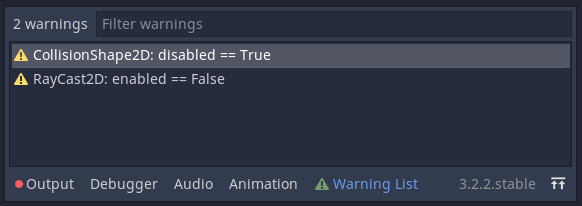

= Godot Node Warnings

This plugin shows you a list of possible errors, caused by configuration of Node-properties.

== Usage
1. Download the plugin from the asset store or download the repository and include it in your Godot project
2. Enable the Plugin in Project -> Project Settings -> Plugins
3. Open a Scene from your project
4. Check for warnings in the bottom dock

== Warning rules
The rules for the warnings are store in a link:./addons/dardanbujupaj.node_warnings/default_warning_rules.json[json-file].
At the root of the json is an object. 
The class name of each Godot-Node that should be checked is a key for the corresponding rules-dict, which contains rules for each property to check.

=== Example
The following rules file checks every RayCast2D Node in the current scene (and ever node inheriting from RayCast2D).
If any of the checked Nodes has the value of the property `enable` set to false, a warning will be shown in the warning list.
The description is shown as a tooltip when hovering over the warning.

..node_warning_rules.json
[source,json]
----
{
    "RayCast2D": {
        "property": "enable",
        "critical_value": false,
        "description": "RayCasts will not collide with bodies while not enabled."
    }
}
----

== Use custom warning rules
1. Copy the file `res://addons/dardanbujupaj.node_warnings/default_warning_rules.json` to `res://.node_warning_rules.json`
2. Edit/add/remove rules in your favorite text editor
3. Reload the plugin